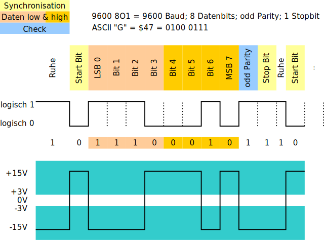
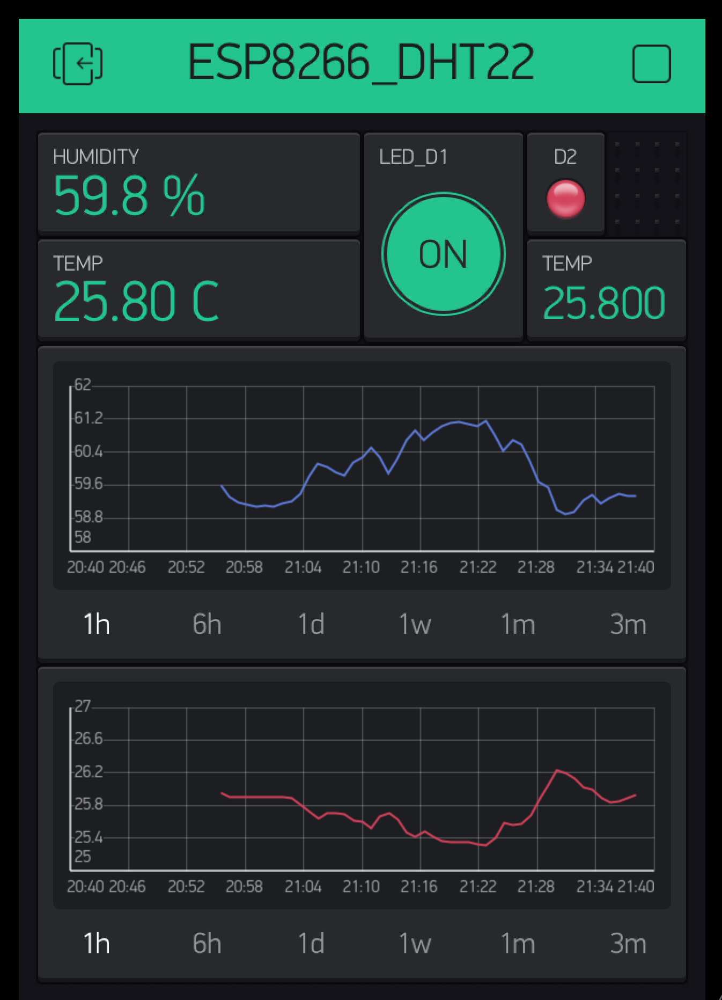

<!---
@Author: andyprv
@Date: 2018-11-05 11:33:31
@Last Modified by: andyprv
@Last Modified time: 2018-11-07 20:04:43
-->

<!-- TITLE: Arduino Workshop -->
<!-- SUBTITLE: A quick summary of Arduino -->

#  Workshop
 

---

## Der Plan :

 1. Was ist Arduino ?
 2. Boardlayout
 3. Wiki - Abkürzungen / Beschriftungen
 4. IDE Software ( **I**ntegrated   **D**evelopment   **E**nvironment )
 5. Blink / Analog Sketch
 6. Debug Sketch
 7. Iot Boards ( NodeMCU / Wemos )
 8. Dallas / Maxim 1-Wire
 9. Q&A - Fragen und evtl. Antworten
10. Ende


---

# Quickstart Video
https://www.youtube.com/watch?v=nL34zDTPkcs

---

### Boardlayout - Abkürzungen / Beschriftungen

  


[Open Arduino UNO Pinout](pic/arduino_pinout.png)

[Open NodeMCU Pinout](pic/NodeMCU-ESP8266-PINs-pinout.jpg)

[Open WEMOS Pinout](pic/wemosd1mini.jpg)

---
more : 

https://www.14core.com/datasheets-pin-outs/        

https://www.arduino.cc/en/Main/Products

---

# Wiki - Abkürzungen / Beschriftungen

Led https://de.wikipedia.org/wiki/Leuchtdiode

---
i²C
https://de.wikipedia.org/wiki/I%C2%B2C

 


---
SPI
https://de.wikipedia.org/wiki/Serial_Peripheral_Interface

> MOSI  /  MISO  & Co  - ( **M**aster **O**ut  **S**lave **I**n )

 

---

PWM ~ 
https://de.wikipedia.org/wiki/Pulsweitenmodulation

... als Analog Spannung Signal
https://www.instructables.com/id/Analog-Output-Convert-PWM-to-Voltage/


... Servo Library <Servo.h>
https://www.mariolukas.de/2011/08/arduino-servo-tutorial/


---
UART  ( RS232 / Serial.print()  )
https://de.wikipedia.org/wiki/Universal_Asynchronous_Receiver_Transmitter

https://www.arduino.cc/reference/en/language/functions/communication/serial/begin/

```arduino
void setup() {
    // opens serial port, sets data rate to 9600 bps
    // SERIAL_8N1 (the default)
    Serial.begin(9600); 

    /* speed: in bits per second (baud) - long
       config: sets data, parity, and stop bits. 
    */
    Serial.begin(19200, SERIAL_8N1)
}
```

> Übliche Bitraten

Bitrate | Bitdauer
------------ | -------------
50 bit/s	| 20,0 ms
. . . . | . . . .
1.200 | bit/s	833 µs
9.600 | bit/s	104 µs
19.200 | bit/s	52,1 µs
57.600 | bit/s	17,4 µs
. . . . | . . . .
500.000 | bit/s	2,00 µs




Terminal ( LKTerm )
https://www.loksoft.ch/sites/downloads/dlTerminal.aspx


---
ADC
https://de.wikipedia.org/wiki/Analog-Digital-Umsetzer

SRAM
https://de.wikipedia.org/wiki/Static_random-access_memory

LoRa
https://de.wikipedia.org/wiki/Long_Range_Wide_Area_Network


LDR ( Fotowiderstand )
https://draeger-it.blog/sainsmart-lektion-4-led-mit-fotowiderstand/


Sketch ( Arduino Programm )
https://www.arduino.cc/en/tutorial/sketch


Shield ( Erweiterungen )
https://www.arduino.cc/en/Main/arduinoShields


Bootloader
https://www.arduino.cc/en/Hacking/Bootloader?from=Tutorial.Bootloader


  


[ Open Pic 1 ](pic/bootloader2.jpg)

[ Open Pic 2 ](pic/bootloader2.jpg)

[ Open Pic 3 ](pic/bootloader2.jpg)


---

# IDE Software ( **I** ntegrated **D** evelopment **E** nvironment )
https://de.wikipedia.org/wiki/Integrierte_Entwicklungsumgebung


[open picture](/uploads/arduino/arduino-ide.png)


Blink.ino sketch :

```arduino
/*
  Blink

  Turns an LED on for one second, then off for one second, repeatedly.

  Most Arduinos have an on-board LED you can control. On the UNO, MEGA and ZERO
  it is attached to digital pin 13, on MKR1000 on pin 6. LED_BUILTIN is set to
  the correct LED pin independent of which board is used.
  If you want to know what pin the on-board LED is connected to on your Arduino
  model, check the Technical Specs of your board at:
  https://www.arduino.cc/en/Main/Products

  modified 8 May 2014   by Scott Fitzgerald
  modified 2 Sep 2016   by Arturo Guadalupi
  modified 8 Sep 2016   by Colby Newman

  This example code is in the public domain.

  http://www.arduino.cc/en/Tutorial/Blink
*/

// the setup function runs once when you press reset or power the board
void setup() {
  // initialize digital pin LED_BUILTIN as an output.
  pinMode(LED_BUILTIN, OUTPUT);
}

// the loop function runs over and over again forever
void loop() {
  digitalWrite(LED_BUILTIN, HIGH);   // turn the LED on (HIGH is the voltage level)
  delay(1000);                       // wait for a second
  digitalWrite(LED_BUILTIN, LOW);    // turn the LED off by making the voltage LOW
  delay(1000);                       // wait for a second
}
```

---
# Tutorials / HowTo
http://www.marc-schaffer.ch/data/Arduino101.pdf
https://www.arduino-tutorial.de/
https://www.tutorialspoint.com/arduino/arduino_tutorial.pdf

## How to Use a Breadboard
https://www.youtube.com/watch?v=6WReFkfrUIk

---
## Debug 
https://forum.arduino.cc/index.php?topic=46900.0

```arduino
#define DEBUG 1

#ifdef DEBUG
 #define DEBUG_PRINT(x)  Serial.println (x)
#else
 #define DEBUG_PRINT(x)
#endif

void loop()
{
...
  // will only printed / compiled in code if DEBUG = 1  
  DEBUG_PRINT ("I'm here");
...
}

#define DEBUG
#include "DebugUtils.h"

``` 

---
## Youtube - Andreas Spiess
https://www.youtube.com/channel/UCu7_D0o48KbfhpEohoP7YSQ

## Dallas 1-Wire 
https://www.youtube.com/watch?v=CjH-OztKe00

### DS2438 - Switch
https://github.com/jbechter/arduino-onewire-DS2438


---
# LevelShifter
https://circuits4you.com/2016/12/14/io-level-conversion-esp8266/
https://hackaday.com/2017/01/20/cheating-at-5v-ws2812-control-to-use-a-3-3v-data-line/


---
# Interrupts
https://www.packtpub.com/mapt/book/web_development/9781785888564/3/ch03lvl1sec27/reading-and-counting-pulses-with-arduino
https://www.electronicwings.com/nodemcu/nodemcu-gpio-interrupts-with-arduino-ide


---
# volatile ( global Var ) 
https://www.arduino.cc/reference/en/language/variables/variable-scope--qualifiers/volatile/

```arduino
// toggles LED when interrupt pin changes state

int pin = 13;
volatile byte state = LOW;

void setup()
{
  pinMode(pin, OUTPUT);
  attachInterrupt(digitalPinToInterrupt(2), blink, CHANGE);
}

void loop()
{
  digitalWrite(pin, state);
}

void blink()
{
  state = !state;
}
```

--- 
# ESP8266 / ESP32  -  IoT Device 
https://www.instructables.com/id/NodeMCU-ESP8266-Details-and-Pinout/
https://www.esp8266.com/wiki/doku.php?id=esp8266-module-family
https://github.com/FablabTorino/AUG-Torino/wiki/Wemos-Lolin-board-(ESP32-with-128x64-SSD1306-I2C-OLED-display)
https://www.instructables.com/id/ESP32-With-Integrated-OLED-WEMOSLolin-Getting-Star/


### ADC
https://www.instructables.com/id/ESP8266-ADC-Analog-Sensors/

### ESP8266 Analog Inputs Expander
https://www.tindie.com/products/AllAboutEE/esp8266-analog-inputs-expander-version-2-2/#specs

---
### SPIFFS & JSON
https://www.youtube.com/watch?v=jIOTzaeh7fs

---
### Connect ESP8266 with the world (and IFTT) through MQTT and Adafruit.io (Tutorial)
https://www.youtube.com/watch?v=9G-nMGcELG8


---
# ATTiny85
https://medium.com/jungletronics/attiny85-easy-flashing-through-arduino-b5f896c48189

I2C - TinyWire 
https://github.com/lucullusTheOnly/TinyWire

I2C - Demo http://forum.arduino.cc/index.php?topic=524760.0

---
# Mobile APP

## ThingSpeak Demo
https://thingspeak.com/channels/82013


## NetIO 
https://netioapp.com/de/projects/
https://netioapp.com/de/projects/868


---
## Blynk
https://www.blynk.cc/
https://www.eevblog.com/forum/microcontrollers/blynk-users-(ios-or-android-app-to-control-arduino-rasbpi-esp8266-over-eth)/




## Thinger
https://thinger.io/

---
# ESPproMon Energy Meter
https://peacefairapp.com/


# SMASE original
https://twinters.de/smase2/
https://www.amazon.de/Bausatz-Pufferspeicher-Temperatur-Anzeige-Kontrolle/dp/B01DI0OMKC

### eigene Variante 
https://github.com/andyprv/SMASE


# IFTTT
https://ifttt.com/

---

# Adafruit
https://io.adafruit.com/andyprv/dashboards/demo
https://learn.adafruit.com/mqtt-adafruit-io-and-you/arduino-plus-library-setup
http://138.197.189.77:1880/#flow/4e2ad3be.02c88c


---
## Boards
https://www.adafruit.com/product/3405

## micro:bit
https://learn.adafruit.com/use-micro-bit-with-arduino/overview


---
# dfrobot Boards
https://www.dfrobot.com/product-1075.html


## Serial.print() / Serial.printF() ???
https://playground.arduino.cc/main/printf


If you use F() you can move constant strings to the program memory instead of the ram. 
This will take up space that will decrease the amount of other code you can write. 
But it will free up dynamic ram.
```arduino
// text1 will be stored in Ram
  Serial.print("text1: ");

// text2 will be stored in fash (program memory) 
  Serial.print(F("text2: "));


  Serial.print(variable, HEX);
/*
will print the value of the variable in HEX, for instance and you can also include \t, \n and \r in strings to give a tab, newline and carriage return respectively.
*/

float ver = 1.1;
  Serial.print("version : ");
  Serial.println(ver,2);
```


---
## Compiler internal Vars
https://forum.arduino.cc/index.php?topic=189325.0

```arduino
// sketch file name
// compile date ( "Sep 22 2013 01:19:49" )

Serial.begin(9600);

  Serial.print("Filename: ");
  Serial.println(__FILE__);
  
  Serial.print("Compilation timestamp: ");
  Serial.println(__DATE__ " " __TIME__);

  Serial.print("Compiler version: ");
  Serial.println(__VERSION__);

  Serial.print("Debug Line: ");
  Serial.println(__LINE__);
```


---
## BME280 - Luftdruck-/Luftfeuchtesensor 

https://arduino-projekte.webnode.at/meine-libraries/luftdruck-luftfeuchtesensor-bme280/

https://learn.adafruit.com/adafruit-bme280-humidity-barometric-pressure-temperature-sensor-breakout?view=all


Fast kompatibel zum Luftdrucksensor BMP280 der Firma Bosch (siehe hier), 
gibt der BME280 neben dem gemessenen Luftdruck und der Umgebungstemperatur auch 
die Luftfeuchtigkeit als Rohwert aus, wobei die Ausgabe wahlweise über 
I2C- oder über SPI-Schnittstelle erfolgen kann. 

Mit Hilfe von 18 im Sensor gespeicherten Kompensationsparametern kann dann aus den Rohwerten
der Luftdruck am Standort (Stationsniveauluftdruck), 
die Luftfeuchte und die Umgebungstemperatur ermittelt werden.

 

BME280 Mini_Breakout_s.jpg


---
# Ausblick nächster Workshop

## Raspberry Industrie
https://www.elektronikpraxis.vogel.de/warum-raspberry-pi-3b-ideal-fuer-die-industrie-ist-a-717988/


.  
.  
.  
.  
---

##### Note  :  
--- 
ARDUINO Workshop for Yaskawa 

11.2018 ; Meier A.  


